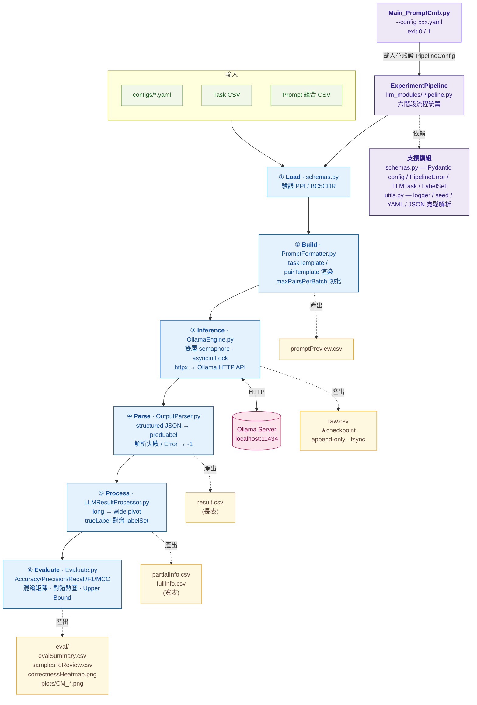

# EnsemblePrompt_ML

以 Ollama 為後端、針對生醫關係抽取（PPI、Chemical–Disease 等）任務的 LLM 推論與評估管線。

---

## 專案目標

- 以多 prompt × 多模型的排列組合，在標準化的 Task CSV 上做分類推論。
- 自動斷點續傳、用 JSON schema 強制 LLM 輸出格式、產出寬表格與分類指標報表。
- 一套 config 同時支援 **PPI**（每筆一個標的，如 LLL）與 **BC5CDR**（每筆多個 pair）兩種任務。

## 主要流程

```
原始資料 ──preprocess──▶ Task CSV ──┐
                                   ├──▶ Pipeline ──▶ raw.csv ──▶ result.csv ──▶ partialInfo.csv ──▶ eval/
Prompt 組合 CSV ───────────────────┘                                        └─▶ fullInfo.csv
```

[ExperimentPipeline.run](llm_modules/Pipeline.py#L68) 將整個流程切成六階段，階段間以檔案傳遞、不靠回傳值：

1. **Load** — 載入 Task CSV × Prompt 組合 × 已完成 checkpoint。
2. **Build** — 依 `maxPairsPerBatch` 切批、渲染 `taskTemplate`/`pairTemplate`，扣掉已完成任務後產生 `LLMTask` 清單。
3. **Inference** — [LLMEngine](llm_modules/OllamaEngine.py) 非同步呼叫 Ollama，每筆完成即 append 寫入 `raw.csv` + `fsync()` 落盤。
4. **Parse** — [OutputParser](llm_modules/OutputParser.py) 解析 structured JSON 回應為 0..N-1 的 `predLabel`（無法解析一律 -1）。
5. **Process** — [LLMResultProcessor](llm_modules/LLMResultProcessor.py) 長表轉寬表：每個 `model|promptID` 一欄。
6. **Evaluate** — [PromptCmbEval](llm_modules/Evaluate.py) 計算 Accuracy/Precision/Recall/F1/MCC、混淆矩陣、難題清單與 Upper Bound。

## 系統架構

下圖呈現「進入點 → Pipeline 六階段 → 各階段負責模組 → 落盤產出 → 外部依賴」的整體結構。階段間以檔案傳遞，標示為 ★checkpoint 的 `raw.csv` 同時是斷點續傳的單一狀態來源。



## 目錄結構

```
.
├── Main_PromptCmb.py         # 進入點；exit code 0 / 1
├── configs/
│   ├── PPI_config.yaml       # LLL（PPI）
│   └── BC5CDR_config.yaml    # BC5CDR（Chemical–Disease）
├── llm_modules/
│   ├── Pipeline.py           # 流程統籌（六階段）
│   ├── OllamaEngine.py       # 非同步推論引擎；raw.csv schema 在這裡
│   ├── OutputParser.py       # structured JSON → predLabel
│   ├── LLMResultProcessor.py # long → wide pivot
│   ├── Evaluate.py           # 分類指標與圖表
│   ├── PromptFormatter.py    # Template 渲染
│   ├── schemas.py            # Pydantic config / Exception / LLMTask
│   └── utils.py              # logger、seed、YAML 載入、JSON 解析
├── preprocess/
│   ├── lll.py                # LLL → tasks.csv（PPI）
│   └── bc5cdr.py             # BC5CDR → tasks.csv
├── promptGenerate/           # 階段零：產生 Prompt 組合 CSV
│   ├── main_PromptGenerate.py # 進入點；窮舉 / 手動組合方法池
│   ├── prompt_config.yaml    # 生成模式與輸出路徑設定
│   └── prompts.yaml          # 方法池（method × 編號）
└── data/                     # 輸入資料與輸出（gitignored）
```

## 環境需求

- Python ≥ 3.11
- Ollama 已安裝並在 `http://localhost:11434` 運行
- 對應模型已 `ollama pull`（例如 `llama3.2:1b`）
- `pip install -r requirements.txt`

## 執行方式

```bash
# 1) 前處理（依資料集擇一，產出標準 Task CSV）
python preprocess/lll.py        # LLL（PPI）
python preprocess/bc5cdr.py     # BC5CDR（Chemical–Disease）

# 2) 跑 Pipeline
python Main_PromptCmb.py --config configs/PPI_config.yaml
python Main_PromptCmb.py --config configs/BC5CDR_config.yaml
```

成功時 exit code 0，失敗時 exit code 1（任何 `PipelineError` 子類例外都會被 `Main_PromptCmb.py` 統一捕捉並記錄到 `logs/llmLog.log`）。

## Prompt 組合生成（promptGenerate）

[promptGenerate](promptGenerate/) 是 Pipeline 之前的「階段零」工具：把一份**方法池**窮舉或手動組合成下游 `paths.promptCmbPath` 讀取的 Prompt 組合 CSV（欄位 `promptID`, `promptText`）。它獨立於主 Pipeline，需要時才跑一次。

```bash
# 產生 Prompt 組合 CSV（讀 promptGenerate/prompt_config.yaml）
python promptGenerate/main_PromptGenerate.py
```

### 方法池（prompts.yaml）

[prompts.yaml](promptGenerate/prompts.yaml) 在 `prompts:` 底下以「方法分類（method）→ 兩位數編號 → prompt 文字」三層結構定義所有可用片段，例如：

```yaml
prompts:
  EMO:
    01: |
      This is very important to my career
  Role:
    01: |
      You are an expert Biocurator for a major biomedical knowledge graph
```

每個片段對應一個 **Prompt ID**，格式為 `{方法分類}{兩位數編號}`（如 `EMO01`、`Role01`、`S2A02`）。內容非 dict 的 method 會被略過並印出警告。

### 生成模式（prompt_config.yaml）

[prompt_config.yaml](promptGenerate/prompt_config.yaml) 以 `b_isExhaustiveCmb` 切換兩種模式：

| 設定 | 模式 | 行為 |
|---|---|---|
| `b_isExhaustiveCmb: true` | Auto（窮舉） | 依 `autoSettings.selectedMethods` 選定分類（`['ALLMethod']` = 全部），對分類做 1..`maxSize` 元的組合，再對各組合內各分類的編號做笛卡兒積，枚舉所有 Prompt 組合 |
| `b_isExhaustiveCmb: false` | Manual（手動） | 只生成 `manualCombinations` 中明確列出的 Prompt ID 組合；找不到的 ID 跳過並警告，整組皆無效則不輸出 |

組合後的 `promptID` 以 ` + ` 串接、`promptText` 以換行串接（例如 `EMO01 + RAR02`）。

### 輸出

| 設定 | 說明 |
|---|---|
| `promptYamlPath` | 方法池來源 YAML（預設 `promptGenerate/prompts.yaml`） |
| `promptCmbOutputPath` | 輸出 CSV 路徑（預設 `data/promptOutput/example_prompts.csv`，UTF-8-SIG），即下游 config 的 `paths.promptCmbPath` |
| `autoSettings.selectedMethods` | Auto 模式參與組合的分類清單；`['ALLMethod']` 代表全部 |
| `autoSettings.maxSize` | Auto 模式單一組合最多包含幾個分類 |
| `manualCombinations` | Manual 模式要生成的 Prompt ID 組合清單（list of list） |

產出 CSV 後，把 `promptCmbOutputPath` 填進主 config 的 `paths.promptCmbPath`，即可餵入 Pipeline。

## PPI vs BC5CDR

整個 config 的行為由 `taskType`（`"PPI"` / `"BC5CDR"`）決定，並由 [PipelineConfig.validateTaskMode](llm_modules/schemas.py#L189) 強制檢查：

| 比較項 | PPI | BC5CDR |
|---|---|---|
| `pairColumns` | `[]`（空） | 非空，如 `["e1","e2"]` |
| `labelColumn` | **必填**（如 `"label"`） | 不使用 |
| `pairTemplate` | 不可設定 | **必填** |
| `maxPairsPerBatch` | 必須為 `1` | 任意 ≥1 |
| Task CSV 必要欄位 | `taskID` + `labelColumn` + `contextColumns` | `taskID` + `pairs` (JSON) + `contextColumns` |
| Ollama JSON schema | `{label}` | `{answers: [{id, label}]}` |
| 範例 | LLL（每句一個 PPI 判斷） | BC5CDR（每篇 abstract 多個 chemical–disease pair） |

[Pipeline._buildTaskBatches](llm_modules/Pipeline.py#L304) 在 PPI 模式會自動把 Task CSV 的 `labelColumn` 包成單元素 `pairs`，讓下游一律用 pair 為單位處理。

## 重要 Config 欄位

| 欄位 | 說明 |
|---|---|
| `paths.taskCsvPath` | 前處理產出的 Task CSV |
| `paths.promptCmbPath` | Prompt 組合 CSV（必要欄位：`promptID`, `promptText`） |
| `paths.outputRoot` | 所有輸出的根目錄；其它 `*Path` 未填 / 相對路徑時自動掛在底下 |
| `selectedModels` | 要測試的 Ollama 模型名稱清單 |
| `contextColumns` | Task CSV 中對應 `taskTemplate` 佔位符的欄位 |
| `pairColumns` | `pairs` JSON 中對應 `pairTemplate` 佔位符的欄位；空 → PPI |
| `labelColumn` | PPI 模式下攜帶 true label 的欄位名稱 |
| `taskTemplate` | 主 prompt 模板；佔位符對應 `contextColumns`（BC5CDR 額外帶 `{pairs}`） |
| `pairTemplate` | BC5CDR 模式下單筆 pair 的格式化模板（會被渲染到 `{pairs}`） |
| `labelSet` | 分類類別字串清單；清單索引即整數 code（`["no","yes"]` → no=0, yes=1） |
| `maxPairsPerBatch` | 每個 LLM task 包含的 pair 數；PPI 必為 1 |
| `concurrencyPerModel` / `maxConcurrentModels` | 雙層非同步併發上限 |
| `ollamaServer.url` / `timeout` | Ollama API 端點與請求超時秒數 |
| `llmOptions` | 透傳給 Ollama 的推論參數（`temperature`、`num_predict`、`num_ctx`…） |

## Label 編碼

[LabelSet](llm_modules/schemas.py#L80) 是標籤對應的單一事實來源：

- `classes` 清單**索引**即整數 code（`["no","yes"]` → no=0, yes=1）。
- `labelToLabelCode` 比對時去空白、大小寫不敏感；未命中一律回 `-1`。
- 同一份 `classes` 也會序列化進 Ollama 的 `format` JSON schema，強制模型只能輸出清單裡的字串。
- 因此**前處理產出的 gold label 必須與 `labelSet` 完全對齊**；不對齊時 [Pipeline._validateLabelAlignment](llm_modules/Pipeline.py#L267) 會在推論前 fail-fast 拋 `DataLoadError`，這是 preprocess/config 不一致最早被攔下的地方（下游 `LLMResultProcessor._prepareDf` 只負責轉碼、不再重複檢查）。
- `-1`（無法解析或標籤錯誤）在指標計算時被排除，但在難題分析的對錯矩陣中一律計為答錯。

## 斷點續傳

`raw.csv` **就是** checkpoint，沒有額外狀態檔：

- 唯一鍵是 `(model, promptID, taskID)` 三元組（見 [TaskRunID](llm_modules/Pipeline.py#L39) 與 `TASK_RUN_ID_COLUMNS`）。
- 推論完成的每筆任務由 [LLMEngine._appendCsv](llm_modules/OllamaEngine.py#L214) 以 `asyncio.Lock` 序列化 append、`flush()+fsync()` 落盤。
- 重跑時 [Pipeline.loadCompletedTaskRunIDs](llm_modules/Pipeline.py#L167) 重建已完成集合，`buildPendingTasks` 過濾掉這些，不需要任何旗標。
- API 失敗（重試 3 次仍失敗）會寫入 `"Error: ..."` 而非 raise；該列**仍算已完成**，下游 `OutputParser` 看到後將該位置標 `-1`。
- 若改動 `raw.csv` 欄位，必須同步更新 [RAW_CSV_COLS](llm_modules/OllamaEngine.py#L19) 與 `TASK_RUN_ID_COLUMNS`；不一致時讀取會拋 `DataLoadError`，必須刪除或備份舊檔再跑。

## 併發模型

[LLMEngine](llm_modules/OllamaEngine.py#L85) 採雙層 semaphore：

- `maxConcurrentModels` — 同時載入幾個模型（外層，避免 VRAM 爆掉）。
- `concurrencyPerModel` — 每個模型內部同時送出幾個請求（內層，由 `defaultdict` 第一次存取時自動建立）。
- 所有寫檔以單一 `fileLock` 序列化。
- `runInference` 用 `asyncio.run` 啟動，並在 `finally` 中關閉 `httpx` 連線池。

## 輸出檔說明

| 路徑（相對 `outputRoot`） | 內容 |
|---|---|
| `raw.csv` | 推論原始紀錄（append-only checkpoint）；欄位 = `RAW_CSV_COLS` |
| `result.csv` | 長表，每個 pair × `(model, promptID)` 一列；`predLabel` ∈ {-1, 0..N-1} |
| `singleOutput/{promptID}_result.csv` | 同上但依 `promptID` 切分 |
| `partialInfo.csv` | 寬表，一列一樣本；欄位包含 `sentID`, `trueLabel`, 各 `model|promptID__pred` |
| `fullInfo.csv` | 同上再補 `__raw`（rawOutput）與 `__sysPrompt` 後綴欄，供人工審閱 |
| `promptPreview.csv` | 所有 `promptID × task` 渲染後的 userPrompt 預覽 |
| `eval/evalSummary.csv` | 各 `(model, promptID)` 的 Accuracy/Precision/Recall/F1/MCC（按 F1 排序） |
| `eval/samplesToReview.csv` | 所有 runKey 都答錯的難題清單 |
| `eval/correctnessHeatmap.png` | 模型 × 樣本對錯熱圖 |
| `eval/plots/CM_*.png` | 各 runKey 混淆矩陣 |

## 開發注意事項

- 命名風格：變數/方法 `camelCase`、類別 `PascalCase`（不是 PEP 8 標準，但全專案一致）。
- 錯誤統一走 `PipelineError` 家族（`DataLoadError` / `TaskBuildError` / `InferenceError` / `ParsingError`），由 `Main_PromptCmb.py` 一處 catch；各階段不要私吞例外。
- `RESERVED_PAIR_FIELDS = {'sentID', 'label'}`（`sentID` = sentenceID）是內部欄位，[PromptFormatter._extractPairFields](llm_modules/PromptFormatter.py#L56) 會剔除，永遠不會洩漏進 prompt。新增 pair metadata 時要嘛不加進 `pairColumns`，要嘛更新這個 frozenset。
- `data/`、`logs/`、`docs/` 都在 gitignore 中，不要把輸出檔 commit 進來。
- 沒有 test suite / linter / build step；驗證方式是手動檢查 `data/<dataset>/output/eval/` 下的輸出。
